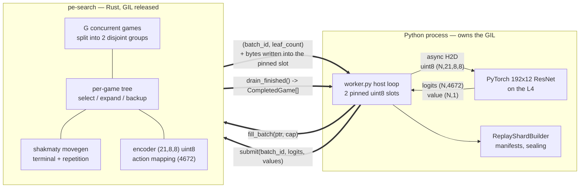
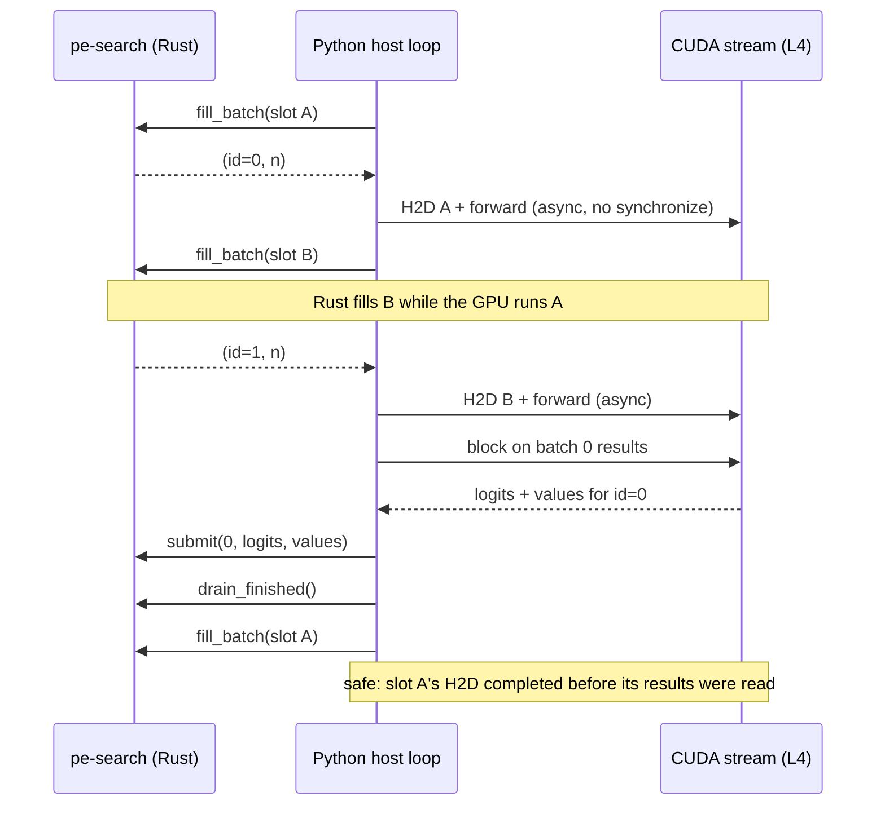

# Move MCTS into a native Rust engine embedded through PyO3

**Date:** 2026-08-19
**Status:** Accepted

## Context

Self-play throughput is bounded by the Python tree search, not by the L4. The best completed run
(`ap-1ipN2SblJAndmpyiu6pu5J`: one L4, 8 CPUs, 8 MCTS processes, 2 trees per process, 16 active
games, 32 simulations) produced 356,101 evaluated leaves in 304.533 seconds:

| Measurement | Value |
| --- | ---: |
| Worker positions/s | 38.157 |
| Evaluated leaves/s, whole worker | 1,169.5 |
| Evaluated leaves/s per allocated CPU | 146.2 |
| Implied CPU cost per leaf | ~6.8 ms |
| Evaluator wall fraction | 30.81% |
| CUDA forward fraction | 27.72% |
| Average model batch | 14.319 |
| Model leaves per model-second | 3,795.9 |

Roughly 69% of worker wall time is Python search, and the surviving GPU time is itself inflated by
small batches: compiled forward measured about 2.10 ms for a batch of ~14, or ~147 us per position,
against a model that costs approximately 1.0 GFLOP per forward. The L4 is idle inside its own
launches because leaves cannot be produced fast enough to fill a batch.

Every optimization since 2026-08-16 has been an attempt to work around one root cause: MCTS
selection, expansion, backup, `chess.Board` copying, `is_repetition`, and `outcome(claim_draw=True)`
run as CPython bytecode under the global interpreter lock. Because threads cannot parallelize that
work, `process_search.py` buys parallelism with spawned processes, pickled queue traffic, and a
strict broker barrier, and then spends 34-47% of wall time waiting on that barrier. The multiprocess
broker, child-side encoding, terminal-status caching, lazy child boards, and the bounded-coalescing
experiments are all mitigations of a constant that is roughly two orders of magnitude too large.

The stated objective is to maximize positions per second on one Modal container with one L4 and
one to two CPUs, then scale horizontally from a known-good single-container configuration.

## Decision

Reimplement the tree search as a native Rust crate, `pe-search`, embedded in the existing Python
worker as a PyO3 extension module. Python keeps the model, the checkpoint stack, shard writing,
manifests, and all Modal orchestration. Rust owns tree state, chess rules, board encoding, and the
action mapping.

The process pool, the inference broker, and the strict barrier in
`self_play/generation/process_search.py` are removed. They exist only to defeat the GIL, and a
native engine defeats it directly.

### Ownership boundary

Python retains the model, checkpoint loading, Parquet writing, manifests, and Modal orchestration.
Rust retains every per-leaf operation. Nothing in the per-leaf path allocates a Python object, so
the whole hot loop runs with the GIL released.

Note that `encoding.py` and `action_mapping.py` are **not** deleted. They are imported by `pgn.py`,
`engine_eval.py`, `arena.py`, `shards.py`, `contracts.py`, `dataset.py`, and `training.py`, none of
which are search code. Those modules define the training-data schema and remain the Python-side
authority; the Rust copies are a second implementation of the same schema, which is what makes the
conformance corpus mandatory.

### Interface

The engine is a batch producer, not an evaluator callback, so no Python frame is entered per leaf.

| Call | Returns | Meaning |
| --- | --- | --- |
| `SelfPlayEngine(spec, seed, games, pending_batches=2)` | engine | Allocates `games` trees, split into `pending_batches` disjoint groups |
| `fill_batch(ptr, capacity)` | `(batch_id: int, leaf_count: int)` | Rows `[0, leaf_count)` of the buffer at `ptr` now hold canonical `uint8 (21,8,8)` encodings. `batch_id` is the ticket that `submit` must quote |
| `submit(batch_id, policy_logits, values)` | `None` | `policy_logits` is C-contiguous `float32 (leaf_count, 4672)`, `values` is `float32 (leaf_count, 1)`; read zero-copy, gathered against retained legal indices, softmaxed, expanded, backed up |
| `drain_finished()` | `list[CompletedGame]` | Games that reached a terminal position since the last call, removed from the active set |
| `active_games()` | `int` | Trees still in play |
| `stop_starting_new_games()` | `None` | Stops replacing finished games so the run drains cleanly instead of overshooting its quota |
| `stats()` | `dict[str, float]` | Engine-side counters and phase timers |

`fill_batch` descends every game in the current group to one leaf, resolves terminal leaves in place
against the exact game outcome (no network call), writes an encoding for each surviving leaf, and
returns. Its entire body is inside `Python::allow_threads`; the closure captures no Python object,
which PyO3 enforces at compile time through the `Ungil` bound.

Legal action indices never cross into Python. Rust retains, per row, the originating node and its
legal indices, so the host returns full 4,672-wide logits and Rust performs the gather and softmax.
This removes the per-row `index_select` loop that cost 9.751 s in the reference run. The price is a
9.6 MB device-to-host transfer at batch 512, roughly 1 ms against a 15-30 ms forward; a GPU-side
padded gather is a follow-up optimization, not a launch requirement.

`CompletedGame` is columnar and per game, not per position, so Python object churn stays
proportional to games rather than leaves: `game_id`, `seed`, `initial_fen`, `moves_uci`, `result`,
`termination`, plus `boards` as `uint8 (plies, 21, 8, 8)`, `selected_action_indices`, `outcomes`,
`ply_indices`, and the visit-count policy in CSR form (`policy_indices`, `policy_probs`,
`policy_offsets`). A thin Python adapter maps this onto the existing `ReplayRow` and `GameRecord`
contracts; teaching `ReplayShardBuilder` to consume the columnar form directly is a follow-up, since
it writes Parquet anyway.

`stop_starting_new_games` exists to fix a known operational problem rather than a performance one:
the recorded lesson that small quotas overshoot by 4-7x because active games must finish atomically.

### Host loop

Python drives the engine with two pinned buffers and one batch of lag, so leaf generation and GPU
inference overlap:

Two slots are required, not merely helpful. `to("cuda", non_blocking=True)` returns before the DMA
engine has finished reading the source buffer, so refilling a single buffer immediately would
corrupt an in-flight transfer silently, producing plausible but wrong model inputs. Two slots plus
one batch of lag make "a slot is refilled only after its transfer completed" an invariant of the
loop structure rather than a rule to remember.

Concurrent games are partitioned into two disjoint groups, one per slot, so no tree ever holds two
outstanding leaves and virtual loss is not required. Model inputs cross as `uint8` (1,344 bytes per
position; 688 KB at batch 512) and the halfmove plane is divided by 150.0 on the device, preserving
the exact semantics of `encode_model_input`.

### Language and dependencies

Rust with PyO3 and maturin, using the `shakmaty` crate for legal move generation and Zobrist
hashing. Rust is chosen over C++ because PyO3 plus maturin is the lowest-friction native-Python
boundary available and because this is tree-mutation-heavy code where the borrow checker is worth
its cost; `shakmaty` supplies a fast, tested movegen that neither C++ nor Go offers as cleanly.
Position history for repetition detection is maintained by the engine as a Zobrist stack rather
than by the chess library.

### Correctness strategy

`mcts.py` is retained permanently as the reference implementation and differential oracle. Parity
is established before any performance claim:

1. **A frozen conformance corpus.** `ENCODER_VERSION` and `ACTION_SCHEMA_VERSION` are stamped into
   every manifest and assert that a board encoded by `pgn.py` and a board encoded by the self-play
   worker are the same tensor, and that a policy index means the same move to the sharder, the
   trainer, and the arena. Today one implementation guarantees that; after this change there are
   two, and neither type system prevents drift.

   The failure mode is the reason this is stage one rather than a nicety. A Rust underpromotion
   plane off by one for Black does not crash, fails no existing test (every current test exercises
   the Python path), and writes well-formed shards with valid-looking indices. Training then learns
   a wrong move for that index, surfacing months later as unexplained Elo stagnation with nothing
   pointing at the cause.

   Select FENs covering every branch of both modules: castling on both sides, en passant, all four
   promotion pieces for both colors, `is_repetition(2)` and `is_repetition(3)`, halfmove clock at and
   above the 150 clip, and insufficient material. Python emits `encode_board` and
   `legal_policy_indices` for each into a committed versioned `.npz`; a Rust test asserts byte
   identity, in CI. The corpus is also what makes the encoder changeable later: bump the version,
   regenerate, and both implementations are forced to move together.
2. Seeded deterministic search summaries from `run_mcts_batch` under a mock evaluator, replayed
   against the Rust engine and compared on visit counts, priors, and selected moves.
3. `board.outcome(claim_draw=True)` is replicated exactly, including python-chess's rule that a
   draw is claimable when a legal move would create a threefold repetition. This is both a parity
   requirement and one of the larger costs being eliminated.

### Packaging

The crate lives at `rust/pe-search/` with its own maturin-backed `pyproject.toml`, consumed by the
root project as a `[tool.uv.sources]` path dependency. The root package keeps hatchling. The Modal
image installs a Rust toolchain and builds the wheel in a cached layer; wheels must be built on
Linux, so a locally built macOS wheel cannot be shipped to Modal.

## Alternatives

- **Continue optimizing Python.** The remaining documented targets (legal-policy gathering at 1.90%
  of wall, CPU input and H2D at well under 1% each) bound the achievable gain below 1.5x, and the
  broker-deadline sweep already showed that trading batch efficiency for latency loses throughput.
  This cannot close a 200x per-leaf gap.
- **Keep MCTS in Python and only enlarge batches.** Directly disproved: doubling active games from
  4 to 8 improved average batch 73.2% and model throughput 61.3% while worker throughput fell 0.70%,
  and the `2 x 4` layout improved model throughput 36.1% while throughput fell 1.1%.
- **Rust MCTS in a separate process, communicating over shared memory or a file the model process
  polls.** Retains an IPC boundary that PyO3 removes for free. File-based handoff adds syscall and
  page-cache latency in the 100 us to millisecond range against a ~16 ms batch budget, provides no
  backpressure, and risks torn reads. A shared-memory ring with futex wakeups would work but is
  strictly more machinery than an in-process call for no benefit inside one container.
- **Run MCTS locally and call Modal for inference over an API.** A local-to-Modal round trip is
  20-50 ms. Saturating the L4 requires roughly 60 batches per second, or a ~16 ms budget per batch
  end to end. This design cannot reach the target and pays for an idle GPU while packets travel.
- **C++ with pybind11, or Go with cgo.** C++ is viable but would require vendoring or writing a
  movegen and has heavier build friction. Go's cgo boundary has per-call overhead and a runtime
  poorly suited to a hot native loop called from CPython.
- **Rewrite inference in Rust as well (tch / ONNX Runtime).** Abandons the existing PyTorch
  checkpoint, training, and evaluation stack for a bottleneck that is not currently binding. Python
  should keep the model.

## Consequences

### Measured outcome

Per-leaf search cost, the constant this change exists to reduce, measured on identical
positions and simulation budgets with a zero-cost evaluator and no model, transfers, or
inter-process traffic (`uv run python scripts/benchmark_native_search.py --engine
search-only`, 200 searches x 32 simulations, Apple M-series):

| Implementation | Per leaf | Leaves/s, one core |
| --- | ---: | ---: |
| `pink_elephant.mcts` | 316.4 us | 3,160 |
| `pe-search` | **2.24 us** | **446,326** |

That is a 141x reduction. The end-to-end host loop confirms the constant holds under
real batching: a 32-game CPU run evaluated 225,784 leaves with 0.747 s of total engine
fill time, or 3.3 us per leaf including encoding into the staging buffer, against 65.1 s
of model forward. Search fell to 1.3% of wall time.

For scale, the reference Modal run implied roughly 6.8 ms of Python per leaf, which
includes deep midgame positions, inter-process traffic, and the broker barrier that this
design deletes outright. The isolated 141x is the defensible number; the production
figure is not yet measured.

### Expected outcome

One Rust core at an estimated 10-30 us per leaf produces 30,000-100,000 leaves/s, against a
projected L4 ceiling of roughly 15,000-25,000 leaves/s at batch 256-512 with FP16 and channels-last.
The bottleneck therefore moves from CPU to GPU, which is the intended state. At 32 simulations per
move this projects to 300-700 positions/s against today's 38.157, a 8-18x improvement. The GPU
estimate assumes 15-25% MFU on 8x8 convolutions and is the least certain number here; the matched
benchmark, not this estimate, is the decision input.

### Migration order

1. Freeze the conformance corpus and the seeded search goldens against current `main`.
2. Build `pe-search` with a synchronous Python-callback evaluator. Prove parity. Measure
   single-core leaves/s in isolation. No Modal involvement.
3. Add the `fill_batch`/`submit` batch interface and the double-buffered host loop. Replace
   `MultiprocessMCTSSearch` in `worker.py`.
4. Add the Modal image build layer and run the matched benchmark.
5. Benchmark 1 CPU against 2 CPUs.

Stages 1 and 2 carry all the correctness risk and none of the infrastructure risk; they are
completed before anything reaches Modal.

### Benchmark protocol

Matched against `ap-1ipN2SblJAndmpyiu6pu5J`: same checkpoint, one L4, 32 simulations, 10,000-position
milestone. Active game count necessarily differs, because filling a batch of 256-512 is the point.
Report `leaves/s` as the primary engineering metric alongside worker `positions/s`, and add
`fill_seconds`, `forward_seconds`, and `stall_seconds` so the CPU-bound/GPU-bound verdict is direct
rather than inferred. Retain the existing batch histogram, model fraction, and game-length
distribution.

The 1-versus-2-CPU decision follows from `stall_seconds`: near zero means leaf production is
limiting and a second core is worth its cost; a fully hidden fill time means one core suffices.
Modal CPU is roughly 17% of the L4's hourly cost, so a second core must return more than 17%.

### Costs and risks

- Two languages, a Rust toolchain, and a compiled artifact in the Modal image build.
- The action mapping and encoder are duplicated in Rust and must not drift. The conformance corpus
  is the enforcement mechanism and must run in CI.
- Trajectories will not be bit-identical to historical runs once batch composition changes, so
  prior runs remain valid only as throughput baselines, not as trajectory references.
- Search semantics are held constant. PUCT, Dirichlet noise, root policy temperature, opening
  temperature, and the temperature cutoff keep their current values and meanings, so this change is
  attributable as a pure throughput change.

### Deliberately out of scope

Wiring the engine into `run_worker`, the generation CLI, and the Modal entrypoints was a
separate change, landed immediately afterwards as `run_native_worker` plus a
`--search-backend native|python` selector. The Python path is retained rather than deleted
so a Modal round can be measured against it in the same image with every semantic search
input held constant; it should be removed once the native path is proven in production.

Batch size is currently `games / pending_batches`, so a large batch requires
proportionally many concurrent games. That couples batch size to the drain tail at the
end of a run. Virtual loss decouples them by letting one tree expose several leaves, and
is the reason it is worth doing later; it is not needed to land this change.

Playout cap randomization, forced playouts, and policy target pruning are deferred. They are the
right follow-up and are far cheaper to implement inside a native engine, but they change what is
recorded and would make this benchmark unattributable. Note for the follow-up ADR: those techniques
change the meaning of `positions/s`, because a recorded position costs many more leaves than the
current 32.

Opening-position diversity, virtual loss, multi-leaf extraction per tree, and horizontal scaling are
also deferred until the single-container configuration is measured.

## Surface Areas

- `rust/pe-search/` (new crate: engine, chess rules, encoder, action mapping, PyO3 bindings)
- `src/pink_elephant/self_play/generation/native_host.py` (double-buffered host loop)
- `src/pink_elephant/modal_image.py` (shared image with the Rust toolchain layer)
- `scripts/build_conformance_corpus.py`, `scripts/benchmark_native_search.py`
- `src/pink_elephant/mcts.py` (retained as reference implementation and differential oracle)
- `src/pink_elephant/self_play/generation/process_search.py` (removed)
- `src/pink_elephant/self_play/generation/worker.py` (host loop, pinned buffers, evaluator)
- `src/pink_elephant/self_play/generation/game.py` (game lifecycle moves into the engine)
- `src/pink_elephant/self_play/generation/config.py`, `cli.py`, `modal_app.py` (execution settings:
  concurrent games and batch size replace process count and trees per process)
- `src/pink_elephant/encoding.py`, `src/pink_elephant/action_mapping.py` (golden-corpus sources)
- `tests/test_mcts.py`, `tests/test_process_search.py`, `tests/test_self_play_generation.py`,
  new conformance and differential tests
- `pyproject.toml`, `uv.lock`, Modal image definition, CI
- Self-play throughput benchmarking, observability counters, and run notes
